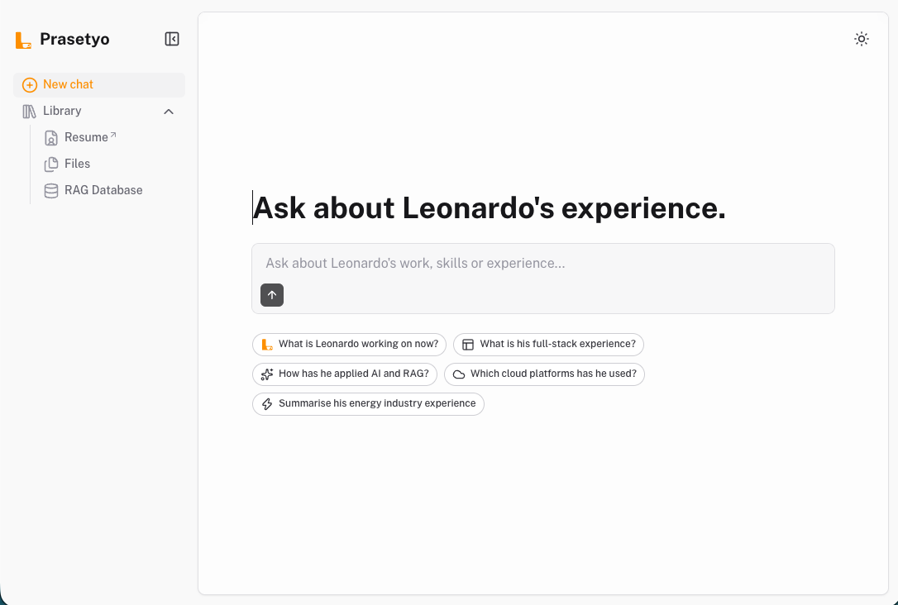

# Leonardo Prasetyo — AI Portfolio

An AI-powered portfolio where visitors can ask about Leonardo Prasetyo's work,
skills, and experience. Answers are grounded in a curated PDF Library using
Cloudflare Workers AI, Vectorize, D1, and R2.

- [Technical documentation](./docs/TECHNICAL_DOCUMENTATION.md)

## Features

- 💬 **Grounded portfolio chat** with streaming answers generated by Cloudflare Workers AI
- 🤖 **Cloudflare AI stack** using Granite chat generation, Qwen embeddings, and AI Gateway
- 📚 **Inspectable source Library** for the published resume, supporting documents, generated chunks, and vector projections
- ⚙️ **Durable document indexing** with Cloudflare Workflows, progress tracking, retries, and vector verification
- 🔐 **Protected administration** through GitHub OAuth and a persisted administrator allowlist
- 💾 **Cloudflare data services** using D1, private R2 storage, and Vectorize
- 🕘 **Private local chat history** with a public daily question quota
- ✨ **Responsive light and dark UI** built with [Nuxt UI](https://ui.nuxt.com) and [Comark](https://comark.dev)
