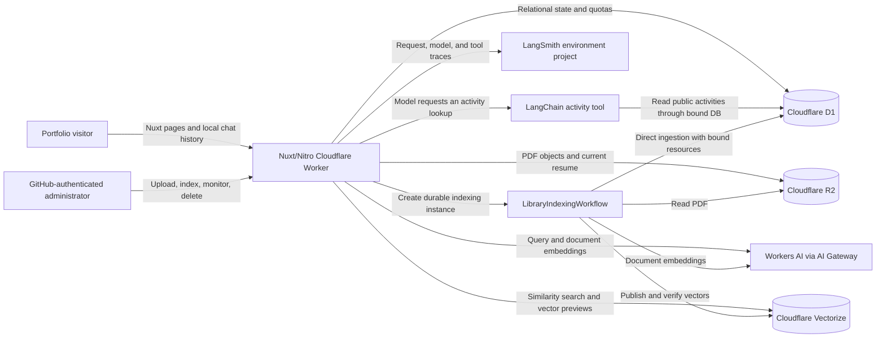

# Leonardo Prasetyo Portfolio and RAG Platform

Technical documentation for the `leonardoprasetyo` repository. This document describes the current working tree as of 7 September 2026.

## 1. System purpose

The project is a public portfolio application built around an AI assistant grounded in published documents and Leonardo's activity timeline. Visitors can ask questions about Leonardo's professional background and recent activities, inspect the sources used to ground answers, browse the generated RAG chunks, and view a two-dimensional projection of their embeddings. An authenticated administration area supports publishing the canonical resume, adding other PDF knowledge sources, monitoring and retrying durable indexing tasks, deleting non-resume documents, and managing activity entries.

The application keeps public chat history in the visitor's browser. Application storage holds authentication, document metadata, indexing state, quota enforcement, retrieval data, and activity entries. When tracing is enabled, LangSmith also receives chat inputs and outputs for debugging; this is separate from browser conversation persistence.

## 2. Technology stack

- **Application:** Nuxt 4, Vue 3, TypeScript, Nuxt UI, Tailwind CSS
- **AI orchestration:** Vercel AI SDK and `workers-ai-provider`, with a structured LangChain activity tool from `@langchain/core`
- **AI observability:** LangSmith request traces for Library retrieval, model steps, tool calls, and answers
- **Generation model:** Cloudflare Workers AI `@cf/ibm-granite/granite-4.0-h-micro`
- **Embedding model:** Cloudflare Workers AI `@cf/qwen/qwen3-embedding-0.6b` (1,024 dimensions)
- **Retrieval:** Cloudflare Vectorize with cosine similarity
- **Database:** Cloudflare D1 (SQLite) through NuxtHub and Drizzle ORM
- **Object storage:** Cloudflare R2
- **Background processing:** Cloudflare Workflows
- **Authentication:** GitHub OAuth through `nuxt-auth-utils`
- **Document processing:** `pdf-lib` metadata normalization, `pdf-parse`, Cloudflare Markdown conversion fallback, and LangChain text splitters
- **Visualisation:** Unovis/Vue scatter plots with a server-side PCA projection
- **Deployment:** Nuxt Nitro's `cloudflare-module` preset and Wrangler

## 3. Architecture



Each environment deploys the same application and Workflow implementation with five required bindings:

| Binding | Service | Responsibility |
| --- | --- | --- |
| `AI` | Workers AI | Chat generation, query embeddings, document embeddings, and PDF-to-Markdown fallback |
| `DB` | D1 | Users, uploads, chunks, tasks, publication lease, daily question counters, and public activity entries |
| `BLOB` | R2 | The canonical fixed-key resume and additive content-addressed Library PDFs |
| `VECTORIZE` | Vectorize | Searchable chunk embeddings, isolated by ingestion-generation namespace |
| `INDEXING_WORKFLOW` | Workflows | Durable resume/document indexing, step retries, and terminal failure recording |

Model calls pass through AI Gateway with request metadata enabled and prompt/response payload logging disabled.

LangSmith tracing is configured separately and records model messages, outputs, and tool results. The LangChain tool runs inside the existing Worker; no separate agent service or LangGraph Agent Server is deployed.

## 4. Main user experiences

### Public portfolio chat

The landing page offers suggested questions and creates a browser-local chat. The chat page streams responses, stores up to 50 conversations in `localStorage`, supports rename/delete/edit/regenerate actions, and groups citations by source file and page.

Only the eight most recent user/assistant messages are sent to the server. The legacy server chat, vote, and upload routes return HTTP 410, making browser storage the active persistence model for public conversations.

For questions about recent work or milestones, chat can query the public activity timeline and add activity citations alongside Library citations. Activity source links open `/leonardo-activity` at the cited entry.

### Public Library and RAG database

The read-only Library surfaces:

- the published non-resume document list and source metadata;
- Vectorize index configuration and published chunk count;
- paginated chunk previews with model, dimensions, vector magnitude, and the first ten embedding values;
- a PCA projection of normalized embeddings, coloured by source page;
- a detail page for each chunk with complete text, provenance, character offsets, token estimate, content hash, and source-PDF link.

The normal document list intentionally hides the resume, but resume chunks participate in retrieval and cite `/api/library/resume/content`. Public APIs only return sources that are public, active, ready, and associated with their current ingestion generation.

### Administration

The unlisted `/admin` area supports two source roles:

1. **Resume:** replaces `library/public/resume/current.pdf`, updates the single non-deleted D1 upload with role `resume`, and automatically creates an indexing task. The resume is the downloadable source of truth and a first-class RAG source, but it is hidden from the normal document list. If the R2 object is unavailable, the public endpoint redirects to the built-in PDF in `public/` as an availability fallback only.
2. **Document:** uploads an additive content-addressed PDF with role `document`, then creates a durable indexing task. Documents can contain project details, extended experience, or any other supporting material and can be deleted independently.

The task detail route `/admin/task/:id` polls the private task API and presents the lifecycle from queueing through extraction, embedding, publication, activation, cleanup, completion, or failure. A failed task exposes a retry action that creates a new D1 task and Workflow instance for the same upload, then navigates to the new task page.

## 5. RAG ingestion pipeline

### 5.1 Upload and source roles

Both upload endpoints accept only a PDF request body up to 10 MiB and validate the content type, request size, and `%PDF-` signature.

`PUT /api/admin/library/resume` sanitises the filename, parses the PDF, sets its embedded `/Title` to the uploaded filename without the `.pdf` extension, and enables the viewer preference to display the document title. It computes SHA-256 over the normalized bytes, writes the fixed R2 key:

```text
library/public/resume/current.pdf
```

The same filename is stored in R2 custom metadata and `Content-Disposition`. This prevents Chrome's PDF viewer from displaying a stale title inherited from an earlier Word/PDF export. Objects uploaded before this normalization are rewritten only in the response path; the endpoint gives those corrected bytes a derived ETag. A subsequent resume upload stores normalized bytes and returns to direct R2 streaming.

The resume upload updates or creates the single D1 row with role `resume` and returns `202 Accepted` with its indexing task. The duplicate checks consider both the original upload checksum and the normalized checksum so a PDF already represented by a document can be promoted or rejected without silently creating conflicting sources.

`PUT /api/admin/library/files` sanitises the filename, computes SHA-256 over the original document, and writes the object to:

```text
library/public/documents/<sha256>.pdf
```

The SHA-256 checksum is unique in D1. Re-uploading identical document content reuses the existing record and R2 key instead of creating a duplicate. A normal document upload is stored first; `POST /api/admin/library/ingest` then creates its indexing task.

### 5.2 Durable task creation

`POST /api/admin/library/ingest` creates an `indexing_tasks` row for a document. The resume upload performs the same queueing operation automatically. In both cases, the task ID is also the Cloudflare Workflow instance ID. Workflow execution is limited to one concurrent instance per environment, and the indexing step retries twice with exponential backoff from five seconds.

`LibraryIndexingWorkflow` is exported from the custom Cloudflare runtime entry and calls the shared ingestion and task-state utilities directly with its environment bindings. It does not make a loopback HTTP request, so it does not depend on browser cookies, CSRF tokens, or internal API routes.

Dispatch failures are written to the D1 task immediately. If all indexing attempts fail, the Workflow runs a dedicated failure-recording step with up to five retries and stores the Workflow name, instance ID, and terminal error in `indexing_tasks.error_message`. This keeps the admin task page accurate even when the Workflow fails outside the request lifecycle.

### 5.3 Extraction and validation

The ingestion service validates the R2 object's size, MIME type, PDF signature, and SHA-256 checksum against D1. Text extraction uses `pdf-parse` first and falls back to Cloudflare's PDF-to-Markdown conversion when necessary.

Enforced document limits are:

- 10 MiB per PDF;
- 200 pages;
- 500,000 extracted characters;
- 250 indexed chunks.

Unsafe control characters are removed before text reaches D1, Vectorize, the user interface, or the model prompt.

### 5.4 Chunking and embeddings

Pages are split with `RecursiveCharacterTextSplitter` using a 1,000-character target, 150-character overlap, and paragraph-to-character separator fallbacks. Chunks shorter than 30 characters are discarded, and duplicate normalized content is removed by SHA-256 hash.

Each chunk stores page provenance, approximate character offsets, an estimated token count, and a content hash. Vector identifiers are derived from the document checksum, ingestion generation, page, and chunk index so a failed or superseded worker cannot overwrite a later generation.

Document embeddings are generated with concurrency three. Chunk rows are written to D1 in batches of six to stay below D1's bound-parameter limit. Embeddings are upserted to Vectorize in batches of 100, with the ingestion ID used as the namespace.

### 5.5 Verification and atomic activation

Vectorize acknowledges writes before they are necessarily queryable. The pipeline therefore polls for up to two minutes and verifies each vector's namespace, upload ID, ingestion ID, content hash, and model before activation.

A five-minute renewable singleton lease serialises publication and deletion across all source roles. Once all new vectors are visible, D1 marks that upload generation ready and active. Publishing a document does not deactivate another document or the resume; each source retains its own active generation. Re-indexing one source removes only that source's previous vectors and chunk rows. Failure handling rolls back only when the Workflow can prove it still owns both the live lease and the processing generation.

## 6. Retrieval and answer generation

For each question, the server:

1. validates the body and conversation limits;
2. reserves daily quota before any model work;
3. embeds the latest question with the retrieval instruction;
4. queries Vectorize for up to 20 candidates across all published sources;
5. reloads authoritative current-generation chunk text from D1, rejects stale matches, preserves Vectorize ranking, and keeps the top five;
6. builds source citations and a bounded context block;
7. lets Granite invoke the activity tool when the question needs timeline information;
8. streams the answer and updated Library/activity citation metadata to the browser, then finalizes the LangSmith trace.

Each retrieved chunk contributes at most 3,500 characters to the model context and a 280-character citation excerpt to the client. Each model step is capped at 800 output tokens. A request permits at most three model steps, with tools disabled for the third step so the model can complete its answer.

The system prompt restricts answers to Leonardo's published professional information. Retrieved PDF text is encoded as JSON and markup delimiters are neutralised so indexed content remains an untrusted data boundary rather than executable instructions.

### 6.1 LangChain activity tool

`server/ai/tools/leonardoActivity.ts` creates the LangChain `search_leonardo_activity` tool for each request and adapts it to the AI SDK's tool interface. `server/utils/leonardoActivitySearch.ts` owns input validation and the parameterized, read-only D1 query.

| Input | Behaviour |
| --- | --- |
| `query` | Optional literal phrase, at most 160 characters, matched against title and description |
| `fromDate` / `toDate` | Optional inclusive `YYYY-MM-DD` bounds; start must not follow end |
| `limit` | Integer from 1 to 10, default 5 |

The tool receives the current request's `DB` binding. Neither the browser nor model can supply a database, environment, or SQL statement. Development therefore reads `leonardoprasetyo-dev`, and production reads `leonardoprasetyo-prod`, with no cross-environment fallback.

Results include only public activity IDs, dates, bounded titles/descriptions, and timeline links. They are ordered by date descending, then editorial order and ID. Date filters and displayed dates use `Australia/Melbourne`, including daylight-saving transitions, through `shared/utils/activityDate.ts`. An extra row detects truncation and sets `hasMore` without claiming the response lists every match.

Each request permits at most two activity lookups. Cancellation is checked before and after the query. Citation labels remain stable across both lookups, and the browser uses the latest citation update. The model is instructed to treat activity content as reference data, distinguish failed lookups from empty results, and avoid inventing missing entries. Granite's occasional double-encoded JSON arguments are repaired only when the decoded object passes the complete tool schema.

### 6.2 LangSmith tracing and workflow inspection

`server/utils/chatTracing.ts` creates a request-scoped LangSmith client using the current environment's service key and project. The trace starts after validation and quota reservation. A typical successful activity request has this structure:

```text
portfolio-chat
  retrieve_library_context
  portfolio-answer
    workersai.chat
    search_leonardo_activity          AI SDK tool call
      search_leonardo_activity        LangChain invocation
    workersai.chat                    Answer using the tool result
```

The two nested activity spans describe the adapter call and its LangChain invocation, not two D1 lookups. Model/tool steps vary with the question. Root metadata identifies `environment`, `database`, and `route`; the database label is diagnostic metadata, while the actual `DB` binding controls access.

Open LangSmith's **Tracing** page and select `leonardo-chat-dev` or `leonardo-chat-prod`, then open a `portfolio-chat` run to inspect inputs, retrieval, model calls, tool arguments/results, timings, and errors. This integration is available through Tracing; Studio would require a separately configured Agent Server.

Trace completion is awaited at the end of streaming and registered with the Worker's `waitUntil`. The client flushes pending batches with bounded request timeout/retries. Delivery failures produce a generic `CHAT_TRACING_ERROR` log without replacing the chat answer. Request cancellation, retrieval failures, and terminal generation failures close the root trace with an error; a recovered tool error remains visible on its child span without marking a subsequently successful answer as failed.

## 7. Data model

### Active application tables

| Table | Purpose |
| --- | --- |
| `users` | GitHub identities and persisted `user`/`admin` role |
| `uploads` | R2 object identity, `resume`/`document` role, checksum, lifecycle, active/public flags, and current ingestion ID |
| `document_chunks` | Authoritative chunk text, provenance, hashes, embedding metadata, and Vectorize IDs |
| `indexing_tasks` | Workflow instance, processing stage, progress, extraction result, attempts, and errors |
| `resume_ingestion_leases` | Singleton renewable lease protecting publication and deletion |
| `question_usage` | HMAC-derived IP identifier and daily UTC question count |
| `leonardo_activities` | Calendar dates, titles, descriptions, order within each day, and optional image reference |
| `activity_feed_state` | Cursor revision and completion marker for legacy date normalization |

`uploads` has a partial unique index allowing only one non-deleted `resume` row. There is no single-active-document constraint: multiple `document` rows and the resume can be active RAG sources simultaneously. `document_chunks` is unique by Vectorize ID and by upload/generation/chunk index.

### Retained legacy tables

`chats`, `messages`, and `votes` remain in the schema for migration compatibility and GitHub identity reconciliation. Public chat persistence has moved to browser `localStorage`, and the corresponding server routes are retired.

## 8. API surface

### Public

| Method and route | Purpose |
| --- | --- |
| `POST /api/chat` | Validate, rate-limit, retrieve Library context, optionally call the activity tool, trace, and stream a grounded answer |
| `GET /api/leonardo-activity` | Return `{ activities, nextCursor }`; optional `limit` (default 20, maximum 50) and opaque `cursor` |
| `GET /api/library/files` | List public active documents; `role=all` also includes the resume |
| `GET /api/library/files/:id` | Return public document metadata |
| `GET /api/library/files/:id/content` | Stream the public PDF with range support |
| `GET /api/library/index` | Return Vectorize/index metadata |
| `GET /api/library/vectors` | Return paginated chunk/vector previews and PCA coordinates |
| `GET /api/library/chunks/:id` | Return a complete active-generation chunk |
| `GET /api/library/resume/content` | Serve the fixed-key resume with synchronized filename/title metadata, or redirect to the built-in fallback |

### Administrator

Activities sort by calendar day descending, then saved order and ID ascending. New
entries prepend within their selected day using an atomic `MIN(order) - 1`; deletes
leave gaps. Up/down controls swap only same-day neighbors, and return only affected
activities. Content edits preserve position; changing the date prepends the entry
within its destination day. The admin derives visible positions from each day's list.

The public timeline appends cursor pages on scroll, with a retry button and an end
state. Cursors include the last date/order/ID and a revision. A database trigger
increments that revision when an existing date or order changes; stale cursors
receive HTTP 409 and the UI offers to refresh from the beginning. Inserts, deletes,
and content edits do not shift existing cursor positions. Chat activity anchors
load subsequent pages until the cited activity can be shown.

Migration `0012` creates the composite index and feed state. On first activity
access, a resumable backfill normalizes legacy timestamps to UTC midnight of their
previously displayed `Australia/Melbourne` day using the runtime's IANA timezone
data. It keeps existing ranks and timestamps for creation/update intact. The state
marker avoids rescanning after completion. New writes already store calendar dates.

| Method and route | Purpose |
| --- | --- |
| `GET /api/admin/session` | Report GitHub authentication and admin authorisation |
| `GET/PUT /api/admin/library/resume` | Inspect or replace the canonical resume; `PUT` also queues indexing |
| `GET/PUT /api/admin/library/files` | List non-resume document records or upload a PDF |
| `DELETE /api/admin/library/files/:id` | Delete object, chunks, and vectors under the publication lease |
| `POST /api/admin/library/ingest` | Queue a durable indexing task |
| `GET /api/admin/library/tasks` | List current and historical tasks |
| `GET /api/admin/library/tasks/:id` | Read detailed task progress |
| `POST /api/admin/library/tasks/:id/retry` | Create a new Workflow task for a failed upload |

## 9. Security and privacy controls

- GitHub OAuth claims a seeded administrator row by matching an approved username or email; all other accounts receive the `user` role.
- Browser administrator mutations require a valid admin session and an explicit same-origin request check. The `/api/admin/library/**` routes bypass cookie-based CSRF middleware because Workflow execution no longer enters through HTTP and these routes enforce their own session/origin boundary. CLI/CI automation may use a `LIBRARY_ADMIN_TOKEN` of at least 32 bytes, compared in constant time.
- The Worker enforces bounded request bodies before Nuxt processes them: 64 KiB for chat, 16 KiB for ingestion commands, 10 MiB for PDFs, and 1 MiB by default.
- Chat validation limits questions to 1,000 characters, the recent conversation to 20,000 characters, and message count to eight.
- Public usage is capped at five questions per network per UTC day. The application stores an HMAC-SHA-256 of the canonical client IP, not the raw IP. A scheduled task removes usage rows older than seven days.
- R2 filenames are sanitised, PDFs are signature-checked, and stored objects use checksums and restrictive response headers. Resume uploads are additionally parsed and normalized so the embedded PDF title agrees with the canonical filename.
- AI Gateway payload collection is disabled for both generation and embeddings.
- LangSmith tracing separately records the question, model messages and outputs, retrieved public excerpts, activity filters/results, timing, and errors. Request headers, cookies, client IPs, credentials, and Worker binding objects are not supplied as tracing fields. User-entered text can still contain personal information and is included in model traces.
- LangSmith keys are separate workspace-scoped service keys for development and production. Local environment files are ignored by Git; production uses an encrypted Worker secret. Keys are not placed in Wrangler `vars` or public runtime configuration.
- Public Library and retrieval queries require each source's exact active ingestion generation, preventing stale or partially published data from leaking into results.

## 10. Configuration and deployment

Local development and production compile the same application and `LibraryIndexingWorkflow` implementation. Local development runs the Worker and Workflow in Wrangler's emulator with remote development storage; only `main` deploys the production Worker through GitHub Actions:

| Resource | Local development | Production |
| --- | --- | --- |
| Worker | Local emulator | `leonardoprasetyo` |
| D1 | `leonardoprasetyo-dev` | `leonardoprasetyo-prod` |
| R2 | `leonardoprasetyo-uploads-dev` | `leonardoprasetyo-uploads-prod` |
| Vectorize | `leonardoprasetyo-documents-dev` | `leonardoprasetyo-documents-prod` |
| Workflow | `leonardoprasetyo-library-indexing-dev` (local emulator) | `leonardoprasetyo-library-indexing-prod` |
| LangSmith project | `leonardo-chat-dev` | `leonardo-chat-prod` |
| LangSmith key source | Ignored root `.env` | Encrypted `LANGSMITH_API_KEY` Worker secret |

CI uses `CLOUDFLARE_DEPLOY_ENV=prod` to validate the production bundle on `main` and pull requests targeting `main`. Development runs locally with `pnpm run dev:local`; pushes and pull requests targeting `dev` do not trigger GitHub Actions. `CLOUDFLARE_LOCAL_DEV=1` selects remote development storage for local testing. Builds reject missing or placeholder D1 UUIDs for their selected environment.

Required secrets:

```text
NUXT_SESSION_PASSWORD
NUXT_OAUTH_GITHUB_CLIENT_ID
NUXT_OAUTH_GITHUB_CLIENT_SECRET
IP_HASH_SECRET
LIBRARY_ADMIN_TOKEN
LANGSMITH_API_KEY
```

`nuxt.config.ts` generates `LANGSMITH_TRACING=true`, the environment-specific `LANGSMITH_PROJECT`, `LANGSMITH_ENDPOINT=https://api.smith.langchain.com`, `APP_ENVIRONMENT`, and `ACTIVITY_DATABASE_NAME`. The development launcher loads the secret from `.env` but preserves these generated configuration values; changing `LANGSMITH_PROJECT` in `.env` does not reroute local traces. Tracing requires both an enabled flag and a key. For a persistent tracing toggle, update the generated setting in `nuxt.config.ts` and rebuild/redeploy; a dashboard-only override can be replaced by a later deployment.

The ignored `.env.production` holds a local backup of the production key and is not loaded by the development launcher. The [Cloudflare runbook](../infra/cloudflare/README.md#activity-chat-tool-and-langsmith-tracing) covers workspace scope, independent key rotation, dashboard access, and deployment verification.

Primary commands:

```bash
pnpm install
pnpm lint
pnpm typecheck
pnpm test:activity-tool
pnpm build
pnpm dev:local
pnpm cloudflare:dry-run
pnpm cloudflare:migrate:dev
pnpm cloudflare:migrate:prod
pnpm cloudflare:deploy:prod
```

`pnpm dev:local` builds the Worker, applies migrations to the remote development D1 database, and starts Wrangler on port 8787. Workers AI, development D1, development R2, and development Vectorize are remote bindings; the Workflow runs in Wrangler's local emulator with the same implementation. `main` deploys production through GitHub Actions. The detailed resource-provisioning and deployment procedure is maintained in [`infra/cloudflare/README.md`](../infra/cloudflare/README.md).

## 11. Repository map

```text
app/
  components/           Nuxt UI, chat, Library, admin, and resume components
  composables/           Browser-local chat and model state
  pages/                 Public chat/Library pages and private admin pages
server/
  ai/tools/             Request-scoped LangChain activity tool and AI SDK adapter
  api/chat.post.ts       Public chat endpoint with Library retrieval and activity tools
  api/library/           Public read-only Library APIs
  api/admin/library/     Authenticated upload, indexing, resume, and task APIs
  db/                    Drizzle schema and D1 migrations
  runtime/               Cloudflare Worker/Workflow entry and body-size enforcement
  utils/                 Ingestion, retrieval, activity queries, tracing, bindings, and quotas
shared/utils/            Shared activity calendar-date handling
tests/                   Activity tool and image tests
infra/cloudflare/        Binding contract, AI Gateway configuration, and runbook
scripts/                 Local Cloudflare development launcher
public/                  Static brand assets and fallback resume
```

## 12. Operational notes and current boundaries

- Multiple public RAG sources can be active. Each upload owns one current generation; re-indexing replaces only that source's prior chunks and vectors.
- The resume is the fixed-key downloadable source of truth and is also indexed with role `resume`. It is not duplicated in the normal document list and cannot be deleted through the document API.
- The built-in static resume is an availability fallback when the R2 binding or `library/public/resume/current.pdf` is missing. It is not the canonical D1/RAG source.
- Existing resume objects without the `pdfTitle` R2 marker are metadata-normalized while served. New uploads persist normalized bytes, the canonical filename, checksum, and marker.
- A failed task remains visible with its terminal Worker error. Retrying creates a new task/Workflow instance rather than mutating historical task identity.
- Public chat history is device- and origin-local. It does not follow a user between browsers and is not recoverable from the server.
- The vector/PCA endpoint selects the requested active upload, or the most recently indexed active source when no `uploadId` is supplied. The plot is computed per returned page of embeddings and is not a globally stable semantic coordinate system.
- Retrieval is dense-vector-only with a fixed top-five result count; there is no keyword/hybrid reranker in the current implementation.
- `pnpm test:activity-tool` verifies query bounds, public field projection, literal search, date validation and Melbourne daylight-saving boundaries, environment isolation, citation stability, lookup limits, cancellation, and safe argument repair. CI runs this suite alongside lint, typecheck, build, and Worker dry-run checks. The real D1/model/stream/tracing path is exercised with `pnpm run dev:local`; stop its retained terminal session after testing and confirm port 8787 is clear.
- Activity lookup reads current D1 rows directly; publishing an activity does not require embedding or Library ingestion. Development and production timelines can contain different entries, including an empty production timeline.
