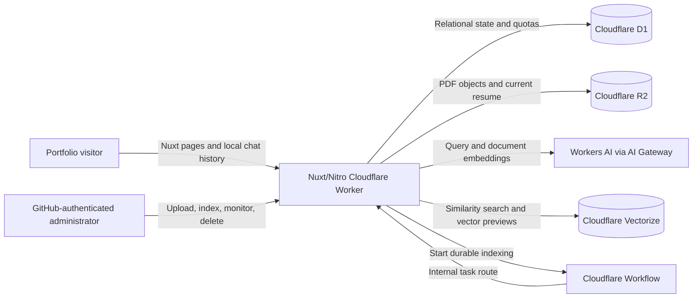

# Leonardo Prasetyo Portfolio and RAG Platform

Technical documentation for the `leonardoprasetyo` repository. This document describes the implementation at commit `d24a21b` (31 August 2026).

## 1. System purpose

The project is a public portfolio application built around a document-grounded AI assistant. Visitors can ask questions about Leonardo's professional background, inspect the PDF source used to ground answers, browse the generated RAG chunks, and view a two-dimensional projection of their embeddings. An authenticated administration area supports publishing a resume, uploading a PDF knowledge source, monitoring durable indexing, and deleting indexed documents.

The application keeps public chat history in the visitor's browser. Server-side storage is reserved for authentication, document metadata, indexing state, quota enforcement, and retrieval data.

## 2. Technology stack

- **Application:** Nuxt 4, Vue 3, TypeScript, Nuxt UI, Tailwind CSS
- **AI orchestration:** Vercel AI SDK and `workers-ai-provider`
- **Generation model:** Cloudflare Workers AI `@cf/ibm-granite/granite-4.0-h-micro`
- **Embedding model:** Cloudflare Workers AI `@cf/qwen/qwen3-embedding-0.6b` (1,024 dimensions)
- **Retrieval:** Cloudflare Vectorize with cosine similarity
- **Database:** Cloudflare D1 (SQLite) through NuxtHub and Drizzle ORM
- **Object storage:** Cloudflare R2
- **Background processing:** Cloudflare Workflows
- **Authentication:** GitHub OAuth through `nuxt-auth-utils`
- **Document processing:** `pdf-parse`, Cloudflare Markdown conversion fallback, and LangChain text splitters
- **Visualisation:** Unovis/Vue scatter plots with a server-side PCA projection
- **Deployment:** Nuxt Nitro's `cloudflare-module` preset and Wrangler

## 3. Architecture



The deployment exposes one Worker with five required bindings:

| Binding | Service | Responsibility |
| --- | --- | --- |
| `AI` | Workers AI | Chat generation, query embeddings, document embeddings, and PDF-to-Markdown fallback |
| `DB` | D1 | Users, uploads, chunks, tasks, publication lease, and daily question counters |
| `BLOB` | R2 | Original Library PDFs and the separately managed downloadable resume |
| `VECTORIZE` | Vectorize | Searchable chunk embeddings, isolated by ingestion-generation namespace |
| `INDEXING_WORKFLOW` | Workflows | Durable document indexing with retry support |

Model calls pass through AI Gateway with request metadata enabled and prompt/response payload logging disabled.

## 4. Main user experiences

### Public portfolio chat

The landing page offers suggested questions and creates a browser-local chat. The chat page streams responses, stores up to 50 conversations in `localStorage`, supports rename/delete/edit/regenerate actions, and groups citations by source file and page.

Only the eight most recent user/assistant messages are sent to the server. The legacy server chat, vote, and upload routes return HTTP 410, making browser storage the active persistence model for public conversations.

### Public Library and RAG database

The read-only Library surfaces:

- the current public PDF and its metadata;
- Vectorize index configuration and published chunk count;
- paginated chunk previews with model, dimensions, vector magnitude, and the first ten embedding values;
- a PCA projection of normalized embeddings, coloured by source page;
- a detail page for each chunk with complete text, provenance, character offsets, token estimate, content hash, and source-PDF link.

Public APIs only return a document when it is public, active, ready, and associated with the current ingestion generation.

### Administration

The unlisted `/admin` area supports two separate publication workflows:

1. **Downloadable resume:** replaces `library/public/resume/current.pdf` in R2. If no uploaded resume is available, the public endpoint redirects to the built-in PDF in `public/`.
2. **RAG Library document:** uploads a content-addressed PDF, starts a durable indexing task, shows stage-by-stage progress, and can delete the R2 object, D1 chunk records, and Vectorize records.

The task detail page polls the private task API and presents the lifecycle from queueing through extraction, embedding, publication, activation, cleanup, completion, or failure.

## 5. RAG ingestion pipeline

### 5.1 Upload

`PUT /api/admin/library/files` accepts only a PDF request body up to 10 MiB. It validates the content type, request size, and `%PDF-` signature, sanitises the filename, computes SHA-256, and writes the object to:

```text
library/public/documents/<sha256>.pdf
```

The SHA-256 checksum is unique in D1. Re-uploading identical content reuses the existing record and R2 key instead of creating a duplicate.

### 5.2 Durable task creation

`POST /api/admin/library/ingest` creates an `indexing_tasks` row and starts a Cloudflare Workflow instance with the same identifier. Workflow execution is limited to one concurrent instance and retries the indexing step twice with exponential backoff from five seconds.

The Workflow enters the application through a local-only internal route. That route rejects normal external requests because it requires the `indexingWorkflow` event context flag.

### 5.3 Extraction and validation

The ingestion service validates the R2 object's size, MIME type, PDF signature, and SHA-256 checksum against D1. Text extraction uses `pdf-parse` first and falls back to Cloudflare's PDF-to-Markdown conversion when necessary.

Enforced document limits are:

- 10 MiB per PDF;
- 200 pages;
- 500,000 extracted characters;
- 250 indexed chunks.

Unsafe control characters are removed before text reaches D1, Vectorize, the user interface, or the model prompt.

### 5.4 Chunking and embeddings

Pages are split with `RecursiveCharacterTextSplitter` using a 1,000-character target, 150-character overlap, and paragraph-to-character separator fallbacks. Chunks shorter than 30 characters are discarded, and duplicate normalized content is removed by SHA-256 hash.

Each chunk stores page provenance, approximate character offsets, an estimated token count, and a content hash. Vector identifiers are derived from the document checksum, ingestion generation, page, and chunk index so a failed or superseded worker cannot overwrite a later generation.

Document embeddings are generated with concurrency three. Chunk rows are written to D1 in batches of six to stay below D1's bound-parameter limit. Embeddings are upserted to Vectorize in batches of 100, with the ingestion ID used as the namespace.

### 5.5 Verification and atomic activation

Vectorize acknowledges writes before they are necessarily queryable. The pipeline therefore polls for up to 30 seconds and verifies each vector's namespace, upload ID, ingestion ID, content hash, and model before activation.

A five-minute renewable singleton lease serialises document publication and deletion. Once all new vectors are visible, a transactional D1 batch deactivates the previous document and activates the new generation. Old vectors, chunk rows, and R2 objects are removed only after the new document is authoritative. Failure handling rolls back only when the worker can prove it still owns both the live lease and the processing generation.

## 6. Retrieval and answer generation

For each question, the server:

1. validates the body and conversation limits;
2. reserves daily quota before any model work;
3. embeds the latest question with the retrieval instruction;
4. queries the active generation's Vectorize namespace for the top five matches;
5. reloads authoritative chunk text from D1 and preserves Vectorize ranking;
6. builds source citations and a bounded context block;
7. streams a Granite response and citation metadata to the browser.

Each retrieved chunk contributes at most 3,500 characters to the model context and a 280-character citation excerpt to the client. Generation is capped at 800 output tokens.

The system prompt restricts answers to Leonardo's published professional information. Retrieved PDF text is encoded as JSON and markup delimiters are neutralised so indexed content remains an untrusted data boundary rather than executable instructions.

## 7. Data model

### Active application tables

| Table | Purpose |
| --- | --- |
| `users` | GitHub identities and persisted `user`/`admin` role |
| `uploads` | R2 object identity, checksum, lifecycle, active/public flags, and current ingestion ID |
| `document_chunks` | Authoritative chunk text, provenance, hashes, embedding metadata, and Vectorize IDs |
| `indexing_tasks` | Workflow instance, processing stage, progress, extraction result, attempts, and errors |
| `resume_ingestion_leases` | Singleton renewable lease protecting publication and deletion |
| `question_usage` | HMAC-derived IP identifier and daily UTC question count |

`uploads` has a partial unique index allowing only one active document. `document_chunks` is unique by Vectorize ID and by upload/generation/chunk index.

### Retained legacy tables

`chats`, `messages`, and `votes` remain in the schema for migration compatibility and GitHub identity reconciliation. Public chat persistence has moved to browser `localStorage`, and the corresponding server routes are retired.

## 8. API surface

### Public

| Method and route | Purpose |
| --- | --- |
| `POST /api/chat` | Validate, rate-limit, retrieve, and stream a grounded answer |
| `GET /api/library/files` | List the current public active document |
| `GET /api/library/files/:id` | Return public document metadata |
| `GET /api/library/files/:id/content` | Stream the public PDF with range support |
| `GET /api/library/index` | Return Vectorize/index metadata |
| `GET /api/library/vectors` | Return paginated chunk/vector previews and PCA coordinates |
| `GET /api/library/chunks/:id` | Return a complete active-generation chunk |
| `GET /api/library/resume/content` | Serve the uploaded resume or redirect to the built-in PDF |

### Administrator

| Method and route | Purpose |
| --- | --- |
| `GET /api/admin/session` | Report GitHub authentication and admin authorisation |
| `GET/PUT /api/admin/library/resume` | Inspect or replace the downloadable resume |
| `GET/PUT /api/admin/library/files` | List private document records or upload a PDF |
| `DELETE /api/admin/library/files/:id` | Delete object, chunks, and vectors under the publication lease |
| `POST /api/admin/library/ingest` | Queue a durable indexing task |
| `GET /api/admin/library/tasks` | List current and historical tasks |
| `GET /api/admin/library/tasks/:id` | Read detailed task progress |

## 9. Security and privacy controls

- GitHub OAuth claims a seeded administrator row by matching an approved username or email; all other accounts receive the `user` role.
- Browser administrator mutations require a valid admin session and a same-origin request. CLI/CI automation may use a `LIBRARY_ADMIN_TOKEN` of at least 32 bytes, compared in constant time.
- The Worker enforces bounded request bodies before Nuxt processes them: 64 KiB for chat, 16 KiB for ingestion commands, 10 MiB for PDFs, and 1 MiB by default.
- Chat validation limits questions to 1,000 characters, the recent conversation to 20,000 characters, and message count to eight.
- Public usage is capped at five questions per network per UTC day. The application stores an HMAC-SHA-256 of the canonical client IP, not the raw IP. A scheduled task removes usage rows older than seven days.
- R2 filenames are sanitised, PDFs are signature-checked, and stored objects use checksums and restrictive response headers.
- AI Gateway payload collection is disabled for both generation and embeddings.
- Public Library queries require the exact active ingestion generation, preventing stale or partially published data from leaking into retrieval.

## 10. Configuration and deployment

Production and `dev:local` use separate D1 databases, R2 buckets, Vectorize indexes, and Workflow names. `nuxt.config.ts` rejects production builds without a real D1 UUID and selects development resources only when `CLOUDFLARE_LOCAL_DEV=1`.

Required secrets:

```text
NUXT_SESSION_PASSWORD
NUXT_OAUTH_GITHUB_CLIENT_ID
NUXT_OAUTH_GITHUB_CLIENT_SECRET
IP_HASH_SECRET
LIBRARY_ADMIN_TOKEN
```

Primary commands:

```bash
pnpm install
pnpm lint
pnpm typecheck
pnpm build
pnpm dev:local
pnpm cloudflare:dry-run
pnpm cloudflare:deploy
```

`pnpm dev:local` builds the Worker, applies migrations to the remote development D1 database, and starts Wrangler on port 8787 with remote Workers AI and development storage bindings. The detailed resource-provisioning and deployment procedure is maintained in [`infra/cloudflare/README.md`](../infra/cloudflare/README.md).

## 11. Repository map

```text
app/
  components/           Nuxt UI, chat, Library, admin, and resume components
  composables/           Browser-local chat and model state
  pages/                 Public chat/Library pages and private admin pages
server/
  api/chat.post.ts       Public RAG chat endpoint
  api/library/           Public read-only Library APIs
  api/admin/library/     Authenticated upload, indexing, resume, and task APIs
  api/internal/          Workflow-only task execution routes
  db/                    Drizzle schema and D1 migrations
  runtime/               Cloudflare Worker entry and body-size enforcement
  utils/                 Ingestion, retrieval, bindings, quotas, and storage helpers
infra/cloudflare/        Binding contract, AI Gateway configuration, and runbook
scripts/                 Local Cloudflare development launcher
public/                  Static brand assets and fallback resume
```

## 12. Operational notes and current boundaries

- Only one public RAG document is active at a time; a new successful generation replaces and cleans up the previous one.
- The RAG document and downloadable resume are intentionally separate R2 objects and can be updated independently.
- Public chat history is device- and origin-local. It does not follow a user between browsers and is not recoverable from the server.
- The PCA plot is computed per returned page of embeddings. It is an exploratory visual approximation, not a globally stable semantic coordinate system.
- Retrieval is dense-vector-only with a fixed top-five result count; there is no keyword/hybrid reranker in the current implementation.
- The repository does not currently expose a formal automated test suite in `package.json`; linting, TypeScript validation, build/dry-run checks, and the documented local Worker exercise are the primary verification gates.

