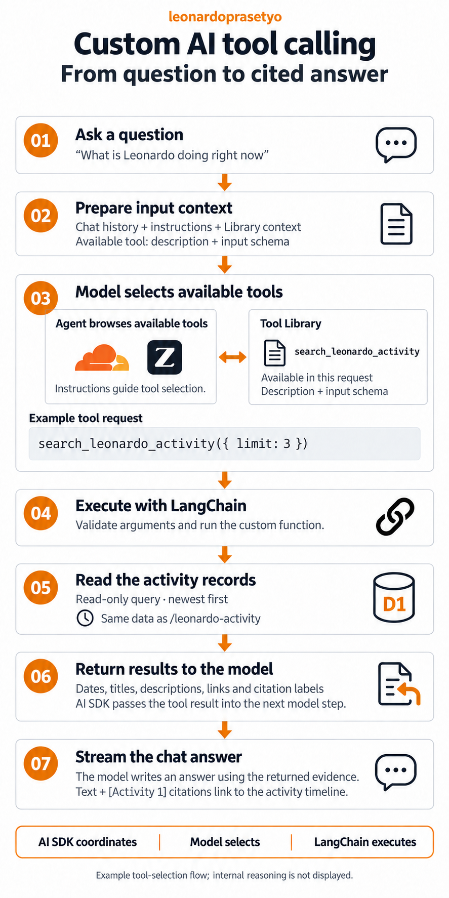

# LinkedIn draft: custom activity tool calling

How does my portfolio assistant answer a question like “What are Leonardo’s latest 3 updates?”

I connected it to the activity records behind my /leonardo-activity page using a custom LangChain tool. Here’s the flow 👇

1. The app prepares the conversation, retrieved Library context, instructions, and the available tool’s description and input schema.

2. GLM-5.3 Flash can request `search_leonardo_activity` with structured arguments, such as `{ limit: 3 }`. My instructions tell it to use this tool for recent work, milestones, and updates.

3. The Vercel AI SDK validates the request and runs the tool adapter, which invokes the LangChain tool. The custom function queries Cloudflare D1 for the matching public activity records.

4. The tool returns dates, titles, descriptions, and links with citation labels. The AI SDK passes those results back into the next model step.

5. The model uses that evidence to write an answer, which streams into the chat alongside citations linking back to the timeline.

The roles became clearer as I built this: the model selects the tool and its arguments, the AI SDK coordinates the steps, and LangChain executes my custom function.

Updating the activity timeline gives the assistant new information to retrieve, without retraining the model. The diagram follows an example tool request; the app keeps internal reasoning out of the chat output.

What would you connect to an AI assistant through a custom tool?

#AgenticAI #LangChain #ToolCalling #Cloudflare #BuildInPublic

---

## Diagram

The current image is a fresh generation consolidating all approved edits, using the [final regeneration prompt](images/activity-tool-calling-fresh-final.prompt.md), followed by the [subtitle removal](images/activity-tool-calling-fresh-v2.prompt.md).

The current infographic's step 01 question is “What is Leonardo doing right now”, shown with quotation marks; see the [question edit prompt](images/activity-tool-calling-v5.prompt.md) and [quotation mark edit prompt](images/activity-tool-calling-v6.prompt.md).

The graphic removes two technical labels from steps 04 and 05 and tightens the step 04 title-to-description spacing; see the [label removal prompt](images/activity-tool-calling-v3.prompt.md) and [spacing edit prompt](images/activity-tool-calling-v4.prompt.md).

## Implementation notes

Checked against the local repository on 14 September 2026. This is an architectural illustration, not a recorded live model trace or a newly tested model response.

- `server/api/chat.post.ts:216`: instructions direct activity questions to the tool. Library retrieval occurs before the first model call.
- `server/api/chat.post.ts:371`: `streamText` receives the tool definition, model configuration, instructions, and messages.
- `server/ai/tools/leonardoActivity.ts:50`: the AI SDK adapter executes `activityTool.invoke(input)`; LangChain runs the structured tool function.
- `server/utils/leonardoActivitySearch.ts:64`: the custom function validates filters and constructs a parameterized D1 query. The model cannot supply SQL or choose the database.
- `server/api/leonardo-activity.get.ts`: the page uses the same activity records. The tool queries D1 directly.
- `server/api/chat.post.ts:392`: the request allows up to three model steps, with tools disabled for the third. The tool also enforces a maximum of two activity lookups.
- `server/api/chat.post.ts:405`: internal reasoning is excluded from the browser stream.
- Tool selection is influenced by the prompt, conversation, available evidence, tool description, and input schema. We can inspect the requested tool and arguments; this diagram does not claim to reconstruct internal reasoning.
- Activity lookup searches the title and description with optional literal text and date filters. It does not retrieve the full milestone article body.

For the general framework behaviour, see the official [LangChain tools documentation](https://docs.langchain.com/oss/javascript/langchain/tools) and [AI SDK loop control documentation](https://ai-sdk.dev/docs/agents/loop-control).

The graphic was generated with the built-in image generation tool and revised to match the earlier RAG infographic. The [original generation prompt](images/activity-tool-calling.prompt.md) and [style revision prompt](images/activity-tool-calling-v2.prompt.md) are saved. Its step order, labels, identifiers, and arrows were visually checked against the implementation. The Tool Library represents the tool definition supplied in the request, and the two-way arrow illustrates the model considering that definition; it does not depict a separate browsing call.
