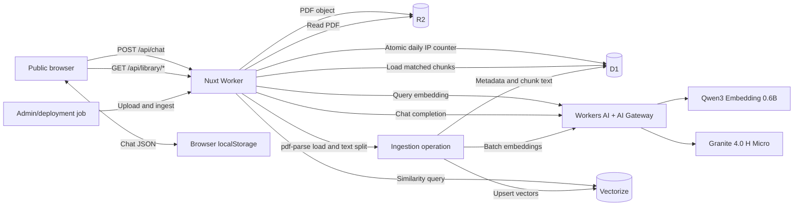

# Public Portfolio Chat and Resume RAG Plan

## Status

- Implemented in the application as of 2026-08-29. Cloudflare resources and
  encrypted runtime secrets still need to be provisioned before deployment.
- The executable build produces `.output/server/wrangler.json`; Nitro also
  produces `.wrangler/deploy/config.json` as a deployment metadata pointer, not
  as a standalone Wrangler configuration.
- Application-owned D1 migrations: `server/db/migrations/sqlite/0003_overjoyed_bloodstrike.sql`, `0004_perfect_nova.sql`, and `0005_many_shinobi_shaw.sql`.
- Target chat model: Cloudflare-hosted `@cf/ibm-granite/granite-4.0-h-micro` through Workers AI and Cloudflare AI Gateway.
- Target embedding model: Cloudflare-hosted `@cf/qwen/qwen3-embedding-0.6b` through the same Workers AI binding and AI Gateway.
- Target public quota: five accepted questions per public IP per UTC calendar day.
- Source document: `public/leonardo-prasetyo-resume.pdf` (currently a two-page PDF).
- Launch hardening is implemented: legacy chat/upload APIs return `410`,
  production request bodies are bounded before Nitro buffering, AI Gateway
  prompt/response payload logging is disabled per request, ingestion holds a
  renewable global D1 lease, and an upload is published only after current-
  generation Vectorize visibility is confirmed.

## Goals

1. Make the portfolio chat available without login.
2. Answer questions about Leonardo using retrieval-augmented generation over the resume.
3. Limit model spend to five questions per public IP per UTC day.
4. Keep visitor chat history in browser `localStorage`, not D1.
5. Store the resume PDF in private R2, file/chunk metadata in D1, and embeddings in Vectorize.
6. Provide a public, read-only `/library` page for inspecting the published R2 document and its Vectorize records.
7. Keep every API key and administrative operation server-side.

## Non-goals

- Public file uploads are not included. Only an administrator or deployment job can publish or re-index the resume.
- The Library page will not expose mutation controls, Cloudflare credentials, raw IP addresses, or every internal R2 object.
- IP limiting is not account identity and will not prevent all determined abuse.
- This phase does not synchronize browser chat history across devices.

## Architecture



The browser must never call Workers AI or AI Gateway directly. It calls the same-origin Nuxt API, and the deployed Worker calls Cloudflare-hosted models through its server-side `AI` binding.

## Model decisions

### Chat generation

- Use the exact model ID `@cf/ibm-granite/granite-4.0-h-micro`.
- Stream portfolio answers through Cloudflare's official Vercel AI SDK provider.
- Set a bounded output limit, initially 800 output tokens.
- Keep the model ID in the non-secret `CHAT_MODEL` Worker variable.
- Route requests through the AI Gateway named `leonardoprasetyo` with response caching disabled for personalized conversations.
- Use a server-owned system prompt that restricts answers to Leonardo's professional background and retrieved sources.
- If the resume does not contain the answer, respond that the information is not available rather than inventing it.

Granite 4.0 H Micro is hosted directly by Workers AI, supports text generation and tool calling, and avoids a separate model-provider credential. The five-question application quota remains the primary visitor-level cost control.

### Embeddings

- Use `@cf/qwen/qwen3-embedding-0.6b` for both document and query embeddings. The generation and embedding models are independent; retrieved chunks are passed to Granite as text.
- Route embedding requests through the Workers AI binding and the same AI Gateway.
- Create the Vectorize index with the model's 1,024 dimensions and cosine distance.
- Use Qwen's asymmetric inputs: `documents` for resume chunks and `queries` plus a resume-retrieval `instruction` for visitor questions.
- Continue extracting and chunking resume text for page-level citations. Native PDF input can be evaluated separately, but one whole-PDF vector is not a substitute for chunk-level retrieval.
- Send bounded batches of document chunks using the model's `documents` input. Keep ingestion concurrency low enough for Worker CPU and subrequest limits.
- Keep one embedding model for both ingestion and queries; changing models requires a new index and a full re-index.
- Use vector IDs derived from the document checksum, unique ingestion generation, page, and chunk number. The ready active revision is an idempotent no-op, while generation separation makes stale-worker cleanup safe.

Qwen3 Embedding 0.6B is hosted by Workers AI and returns 1,024 values per input. Its separate query and document input modes are a good fit for asymmetric resume retrieval, and no external provider API key is required.

## Public chat request flow

1. Load chat messages from `localStorage` after the Vue component mounts.
2. Accept a question on the public chat page without requiring GitHub authentication.
3. Send the latest question and a bounded recent message window to `POST /api/chat`.
4. Reject client-supplied system messages, model names, provider URLs, and API credentials.
5. Resolve the visitor IP from the Cloudflare-controlled `CF-Connecting-IP` request header.
6. HMAC-SHA256 the normalized IP with the `IP_HASH_SECRET`; never persist or log the raw IP.
7. Atomically reserve one of the five daily questions in D1.
8. Generate a 1,024-dimensional query embedding through Workers AI and AI Gateway using Qwen's retrieval instruction.
9. Query `VECTORIZE` for the top five resume chunks and retrieve their full text from D1.
10. Call `@cf/ibm-granite/granite-4.0-h-micro` through Workers AI and AI Gateway with the retrieved context.
11. Stream the response and citations to the browser.
12. Store the completed assistant message in `localStorage`.

The request body should be constrained initially to:

- One new user question of at most 1,000 characters.
- At most eight recent user/assistant messages.
- At most 20,000 total conversation characters before retrieved context.
- No user-controlled system prompt or tool definitions.

## Five-question daily IP limit

### Definition

- The limit is five accepted chat requests per HMAC-hashed public IP per UTC calendar day.
- It resets at `00:00:00 UTC`, not as a rolling 24-hour window.
- The sixth request returns HTTP `429` without invoking Qwen embeddings or Granite generation.
- A request consumes its quota after validation and before paid AI work. Provider failures count initially to keep concurrency behavior deterministic.
- Responses expose `X-RateLimit-Limit`, `X-RateLimit-Remaining`, and `X-RateLimit-Reset` headers.

### D1 projection

Add a Drizzle/D1 migration equivalent to:

```sql
CREATE TABLE question_usage (
  usage_date_utc TEXT NOT NULL,
  ip_hash TEXT NOT NULL,
  question_count INTEGER NOT NULL DEFAULT 0,
  updated_at INTEGER NOT NULL DEFAULT (unixepoch()),
  PRIMARY KEY (usage_date_utc, ip_hash),
  CHECK (question_count >= 0 AND question_count <= 5)
);
```

Use a single D1 upsert with a `question_count < 5` predicate and `RETURNING` so concurrent requests cannot independently pass a read-then-write check. No returned row means the limit has been reached.

Delete usage rows older than seven days with a daily Cron Trigger. The application does not need long-term IP-derived data.

### Limitations and mitigations

- People behind the same home, company, school, or carrier NAT may share five questions.
- IPv6 privacy addresses, VPNs, and proxy rotation can bypass an IP-only limit.
- Do not trust a browser-provided `X-Forwarded-For` value. Production uses Cloudflare's `CF-Connecting-IP` value.
- Add Turnstile after repeated abuse, while retaining the five-question D1 counter as the hard cost boundary.
- Keep AI Gateway spending alerts and provider spend limits enabled as a second boundary.

## Secrets and environment configuration

The repository's `.gitignore` already excludes `.env` and `.env.*` while allowing `.env.example`.

Use a local, uncommitted root `.env` for development:

```dotenv
IP_HASH_SECRET=
LIBRARY_ADMIN_TOKEN=
CLOUDFLARE_ACCOUNT_ID=
CLOUDFLARE_API_TOKEN=
```

Use non-secret Worker variables for:

```dotenv
AI_GATEWAY_ID=leonardoprasetyo
CHAT_MODEL=@cf/ibm-granite/granite-4.0-h-micro
EMBEDDING_PROVIDER=workers-ai
EMBEDDING_MODEL=@cf/qwen/qwen3-embedding-0.6b
EMBEDDING_DIMENSIONS=1024
QUESTION_DAILY_LIMIT=5
```

An `.env` file is for local development and Wrangler/CI input; it must not be bundled into the public application. For the deployed Worker, upload runtime secrets as encrypted Worker secrets:

```bash
pnpm exec wrangler secret put IP_HASH_SECRET --config .output/server/wrangler.json
pnpm exec wrangler secret put LIBRARY_ADMIN_TOKEN --config .output/server/wrangler.json
```

`CLOUDFLARE_API_TOKEN` is a provisioning/CI credential, not an application runtime secret. Keep it in the CI secret store or the local uncommitted `.env` only.

Granite and Qwen are both Cloudflare-hosted Workers AI models. They are authenticated by the Worker `AI` binding and need no OpenAI, Google, or other model-provider API key. `CLOUDFLARE_API_TOKEN` remains necessary only for provisioning or CI deployment and must never be exposed to the browser.

## PDF Library ingestion flow

### Administrative surface

Create server-only endpoints or an equivalent deployment command:

- `PUT /api/admin/library/files` uploads any PDF into R2.
- `POST /api/admin/library/ingest` starts or reruns ingestion for an explicit `uploadId`.

Both operations require a constant-time comparison against `LIBRARY_ADMIN_TOKEN`. They are not linked from the public Library page. Prefer invoking them from CI or a local deployment command rather than a browser admin UI.

### Object and metadata lifecycle

1. Read the selected PDF from the deployment job.
2. Validate MIME type, PDF magic bytes, and a conservative maximum size such as 10 MiB.
3. Calculate SHA-256 before upload.
4. Upload to private R2 at `library/public/documents/<sha256>.pdf`.
5. Upsert a D1 `uploads` row with status `uploaded` and mark it as a public Library document.
6. Atomically acquire or take over the expiring singleton D1 publication lease, assign its UUID generation to the upload, and change status to `processing`.
7. Read the object through the `BLOB` R2 binding and convert its body to a `Blob`.
8. Load the Blob with `pdf-parse`, disable JavaScript evaluation and worker fetches, and preserve page metadata.
9. Split text with `RecursiveCharacterTextSplitter`, initially around 1,000 characters with 150-character overlap.
10. Drop blank and near-duplicate chunks.
11. Call `@cf/qwen/qwen3-embedding-0.6b` through the Workers AI binding with the document chunks in the model's `documents` input. Route the call through AI Gateway and require exactly 1,024 values per vector.
12. Stage generation-marked chunk rows in D1, then upsert generation-specific vectors through the `VECTORIZE` binding using the ingestion UUID as the namespace and carrying the generation and content hash in metadata.
13. Read every expected ID back and require the current generation namespace, upload ID, content hash, and embedding model.
14. Store chunk text, page number, vector ID, checksum, generation, and embedding model in D1.
15. Mark the upload `ready` only through an owner-checked transactional active-document switch.
16. On failure, clean only the current generation while its lease is still owned. An interrupted worker is fenced out and a later request can take over after expiry.

### PDF parser compatibility checkpoint

Cloudflare Workers provides Node compatibility but is not a full Node.js server. Treat PDF parsing as an explicit technical spike before the rest of ingestion is built:

- Add `@langchain/textsplitters` and `pdf-parse`; avoid the broader deprecated `@langchain/community` package when only PDF extraction is needed.
- Run the real two-page resume through the Worker locally and remotely.
- Run `wrangler deploy --dry-run` to validate compressed bundle size and startup time.
- Measure CPU time and memory. PDF parsing is unlikely to fit the Workers Free 10 ms CPU allowance; plan on Workers Paid for the ingestion operation.
- Keep parsing out of global module initialization.

If local PDF parsing cannot meet Worker bundle or CPU constraints, retain the splitter stage but replace extraction with Cloudflare's `env.AI.toMarkdown()` PDF conversion. This preserves the R2 → Worker → document splitting → embedding → Vectorize flow while using Cloudflare's supported PDF parser.

### Idempotent replacement

- Derive each vector ID from `<file-sha256>:<ingestion-generation>:<page>:<chunk-index>`.
- Re-ingesting the current active checksum is a no-op. A retry generation uses distinct IDs so an expired worker cannot overwrite or delete its successor's vectors.
- For a changed PDF, finish indexing the new checksum before making it active.
- Switch the active document in D1, then delete the old Vectorize IDs and old R2 object in a cleanup step.
- Chat retrieval filters on the active upload ID so a partial re-index is never visible.

If a 1,536-dimensional Gemini index was created before this plan changed, create a new 1,024-dimensional index rather than trying to modify it, update the Worker binding, and re-embed the full corpus. Vectorize dimensions and distance metric are fixed when an index is created.

## D1 data changes

Convert the existing infrastructure SQL into application-owned Drizzle migrations and add:

- `question_usage`: hashed-IP daily quota counters.
- `uploads.is_public`: controls whether a document appears in the Library.
- `uploads.is_active`: identifies the current resume revision.
- `uploads.page_count`: extracted PDF page count.
- `uploads.indexed_at`: completed ingestion timestamp.
- `document_chunks.page_number`: citation page.
- `document_chunks.char_start` and `char_end`: optional provenance offsets.
- `document_chunks.content_hash`: duplicate detection and stable diagnostics.
- `document_chunks.ingestion_id`: ownership marker for staged and published chunk generations.
- A unique `(upload_id, ingestion_id, chunk_index)` index allows a successor generation to publish even if an expired worker completes a late D1 insert; public reads select only `uploads.ingestion_id`.
- `resume_ingestion_leases`: singleton, renewable publication lease with UUID owner, upload target, and expiry.

Vectorize is an index of vector records, not a SQL table. D1 remains the relational source of truth and maps each `document_chunks.vector_id` to the matching Vectorize record.

## Read-only Library page

Create `app/pages/library.vue`, available publicly without authentication.

### Read-only APIs

- `GET /api/library/files`: return public, ready D1 upload rows and safe R2 metadata.
- `GET /api/library/files/:id`: return document metadata and ingestion state.
- `GET /api/library/files/:id/content`: stream the public resume PDF from R2 with `Content-Type: application/pdf`, inline disposition, ETag, and cache headers.
- `GET /api/library/vectors?uploadId=<id>&cursor=<cursor>`: page through D1 chunk IDs, fetch the corresponding records with `VECTORIZE.getByIds()`, and return a safe inspection projection.
- `GET /api/library/index`: return `VECTORIZE.describe()` information such as dimensions and metric.

The vector inspection response should include:

- Vector ID.
- Source filename and page.
- Chunk index and a bounded text preview.
- Embedding model and 1,024 dimensions.
- Vector magnitude and, optionally, only the first 8–12 numeric components.
- Indexed timestamp.

Do not send every 1,024-value vector for the entire index to the browser. Paginate, cap results, and expose only records belonging to an active public upload.

### Library UI

- **R2 Objects panel:** filename, size, checksum prefix, content type, updated time, ingestion status, and an inline PDF viewer/download action.
- **Vectorize panel:** index configuration, number of published chunks, embedding model, and paginated vector cards/table.
- **Chunk preview:** page number, text excerpt, vector ID, and a short numeric preview.
- Clearly label the page read-only and provide no upload, re-index, edit, or delete controls.

The public APIs must contain only `GET` handlers. Keep all mutations under `/api/admin/library/*`, protected separately.

## Application file plan

### Add

- `app/composables/useLocalChats.ts`
- `app/pages/library.vue`
- `server/api/chat.post.ts`
- `server/api/library/files.get.ts`
- `server/api/library/files/[id].get.ts`
- `server/api/library/files/[id]/content.get.ts`
- `server/api/library/vectors.get.ts`
- `server/api/library/index/index.get.ts`
- `server/api/admin/library/files.put.ts`
- `server/api/admin/library/ingest.post.ts`
- `server/utils/cloudflareBindings.ts`
- `server/utils/dailyQuestionLimit.ts`
- `server/utils/libraryRetrieval.ts`
- `server/utils/documentIngestion.ts`
- New Drizzle migration for quota and Library metadata.

### Change

- `nuxt.config.ts`: bind `AI`, `DB`, `BLOB`, and `VECTORIZE` for Cloudflare production while preserving local drivers.
- `app/pages/index.vue`: create local chats and navigate without inserting a server chat row.
- `app/pages/chat/[id].vue`: load/save local messages and use the public `/api/chat` transport.
- `app/layouts/default.vue`: list locally stored chats and add the Library navigation item.
- `infra/cloudflare/wrangler.bindings.jsonc`: use Cloudflare-hosted Granite, Qwen, 1,024 embedding dimensions, and the daily limit variables.
- `.env.example`: document secret names with empty values only.
- `package.json`: add the focused PDF parser and text-splitter dependencies.

### Retire after migration

- Server chat CRUD persistence for `chats`, `messages`, and `votes`.
- Authentication checks that prevent public visitors from asking questions.
- Public model selection. The server owns the only allowed chat model.

GitHub authentication can remain for other portfolio administration, but normal chat and Library reads must not require it.

## Delivery phases

### Phase 1: Infrastructure and secrets

- Provision/bind D1, R2, a 1,024-dimensional Vectorize index, Workers AI, and AI Gateway. No external model-provider credential is required.
- Update the binding fragment and environment examples.
- Upload Worker secrets and confirm none appear in client bundles or Wrangler vars.
- Add the D1 migration and cleanup Cron Trigger.

### Phase 2: Public chat and quota

- Move chats to `localStorage`.
- Replace server chat persistence with `POST /api/chat`.
- Add the atomic hashed-IP daily counter.
- Integrate Granite through the Workers AI binding and AI Gateway.
- Add clear remaining-question UI and a reset timestamp.

### Phase 3: PDF Library ingestion

- Implement private R2 upload and D1 metadata.
- Complete the hardened `pdf-parse` compatibility spike.
- Implement chunking, batch embeddings, Vectorize upsert, and idempotent retry.
- Upload and index the repository resume PDF.

### Phase 4: Retrieval and citations

- Add query embedding and Vectorize search.
- Load matched D1 chunks and inject bounded context.
- Return page-level citations linked to the Library PDF viewer.

### Phase 5: Library

- Add read-only APIs.
- Build the R2 document and Vectorize inspection UI.
- Verify public endpoints cannot mutate Cloudflare resources.

### Phase 6: Hardening and launch

- Add abuse monitoring, spend alerts, retention cleanup, security headers, and optional Turnstile.
- Load test concurrent sixth requests from one IP.
- Test cold starts, AI errors, ingestion retries, and browser storage quota handling.
- Deploy staging, index the resume, run acceptance tests, then promote production.

## Test plan

### Unit

- First through fifth daily questions succeed; sixth returns `429`.
- Concurrent fifth/sixth requests cannot both pass.
- UTC date rollover creates a new quota row.
- IPv4 and IPv6 inputs produce stable HMAC hashes without storing raw IPs.
- Missing production `CF-Connecting-IP` fails closed.
- Retrieval filters out inactive or non-public uploads.
- The active-ready no-op and generation-specific IDs make repeat ingestion idempotent without stale-worker collisions.

### Integration

- Granite requests appear in the expected AI Gateway logs.
- R2 upload, retrieval, range/inline PDF response, and checksum verification work.
- The real resume parses inside the deployed ingestion Worker.
- Every document and query embedding has exactly 1,024 dimensions.
- Document and query requests use their respective Qwen inputs and appear in the expected AI Gateway logs.
- D1 chunk rows and Vectorize IDs remain in sync after success and failure.
- Library vector pagination uses `getByIds()` and never requires an account API token in browser code.

### End-to-end

- A signed-out visitor can create and continue a chat.
- Chat history survives refresh in the same browser origin.
- A sixth question shows a clear daily-limit message without invoking AI.
- Resume-grounded answers contain filename/page citations.
- `/library` displays the R2 resume and safe Vectorize details.
- Public `POST`, `PUT`, `PATCH`, and `DELETE` attempts against Library read routes return `404` or `405`.
- Admin ingestion rejects a missing or incorrect token.

## Acceptance criteria

- `@cf/ibm-granite/granite-4.0-h-micro` is the only production chat model.
- Public visitors do not need an account to ask questions.
- No hashed IP can consume more than five accepted questions during one UTC day.
- No raw visitor IP is persisted in application storage.
- No provider or Cloudflare token is present in browser code, committed files, or non-secret Wrangler variables.
- The repository resume exists in private R2 and has an active, ready D1 record.
- Its chunks exist in Vectorize with 1,024 values and matching D1 vector IDs.
- Chat answers retrieve resume context and cite the source page.
- `/library` is public and read-only.
- Re-ingesting the same resume is safe and does not duplicate chunks.

## Risks requiring an explicit implementation decision

1. **PDF parsing on Workers:** verify bundle, Node compatibility, CPU, and memory with `pdf-parse`; keep Cloudflare `toMarkdown()` as the documented fallback.
2. **Shared IP quotas:** accept the portfolio-scale tradeoff or add an anonymous signed cookie plus Turnstile for fairer limits.
3. **Public resume exposure:** this plan assumes the resume is intentionally public because it is already shipped under `public/`.
4. **Failed requests consuming quota:** this plan counts them for simple atomic enforcement. Add reservation/refund state only if production failures make that user experience unacceptable.
5. **Library vector exposure:** show a short numeric preview, not complete vectors in bulk.
6. **Embedding-provider regression:** retrieval quality is corpus-specific. Maintain a small resume-question evaluation set and re-run it before changing model, dimensions, chunking, or retrieval instructions.

## References

- [AI Gateway Workers bindings](https://developers.cloudflare.com/ai-gateway/usage/worker-binding-methods/)
- [Workers AI with the Vercel AI SDK](https://developers.cloudflare.com/workers-ai/configuration/ai-sdk/)
- [Granite 4.0 H Micro](https://developers.cloudflare.com/workers-ai/models/granite-4.0-h-micro/)
- [Qwen3 Embedding 0.6B](https://developers.cloudflare.com/workers-ai/models/qwen3-embedding-0.6b/)
- [Cloudflare Worker secrets](https://developers.cloudflare.com/workers/configuration/secrets/)
- [Cloudflare request headers](https://developers.cloudflare.com/fundamentals/reference/http-headers/)
- [Cloudflare Vectorize limits](https://developers.cloudflare.com/vectorize/platform/limits/)
- [Create Vectorize indexes](https://developers.cloudflare.com/vectorize/best-practices/create-indexes/)
- [Vectorize Worker API](https://developers.cloudflare.com/vectorize/reference/client-api/)
- [Vectorize query guidance](https://developers.cloudflare.com/vectorize/best-practices/query-vectors/)
- [R2 Worker binding](https://developers.cloudflare.com/r2/api/workers/workers-api-reference/)
- [Cloudflare PDF-to-Markdown fallback](https://developers.cloudflare.com/workers-ai/features/markdown-conversion/usage/binding/)
- [pdf-parse](https://github.com/mehmet-kozan/pdf-parse)
- [Cloudflare Workers limits](https://developers.cloudflare.com/workers/platform/limits/)
